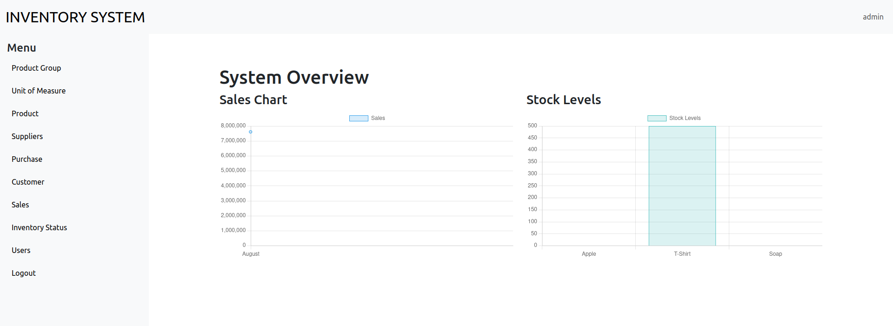

# General Inventory System

## Introduction
The Inventory System, a web based application designed to manages the purchase, sales and stocks. It keeps the records of sales and purchases. 

## Features
- Choose an existing Customer or opt for 'No Customer'.
- Select products from a List and Specify Quantity.
- Ensure sufficient Stock is available before processing Sales.
- Automatically calculate the total Sales amount based on Quantities and Unit Prices.
- Provide clear error messages for issues like insufficient stock or missing product details.

## Getting Started

### Prerequisites

Before you begin, ensure you have met the following requirements:

- Must Have MacOS/Windows OS/Linux OS
- Must Installed PHP
- Must Installed mySQL Database and Apache Server

Note: If you have Installed XAMPP in your local Machine. It will Automatically Contains PHP, mySQL Database and Apache Server.


### Usage
- Run the Server and Database in your Local Machine.
- Create a Database name with `inventory`;
```sql
CREATE DATABASE inventory;
```
- Execute all the Command of `includes/InventorySystem.sql` from `http://localhost/phpmyadmin/index.php?route=/database/sql&db=inventory`
- Now, Open the project in your local system.
```url
http://localhost/GeneralInventorySystem/
 ```

### Login Details
- Admin User
  - Username: `admin`,  Password: `admin`
- Shopkeeper User
  - Username: `user`, Password: `user`
